# 🧭 Atlas: The All-In-One Student Success Agent

Welcome to **Atlas**, an enterprise-grade Student Success Agent designed to unify the fragmented university university experience. By translating complex systems (Financial Aid, Advising, Registration, Wellness) into a single conversational interface, Atlas empowers students to navigate their academic journey seamlessly and autonomously.

---

## 🚀 The Agentic AI Architecture

<p align="center">
  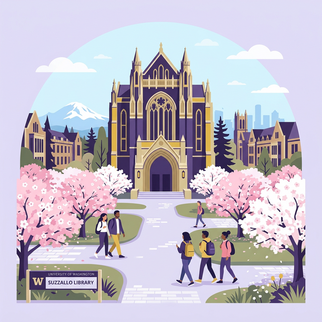
</p>

Atlas has evolved from a standard hardcoded REST API into a **True Agentic AI Architecture**. At its core sits Google's Gemini 2.5-flash Large Language Model, acting as the central orchestration "brain." Rather than relying on simple text responses, the LLM is equipped with specialized Python tools that allow it to autonomously fetch data from or mutate data within our system of record (**Salesforce**).

### 🏗 Architecture Overview

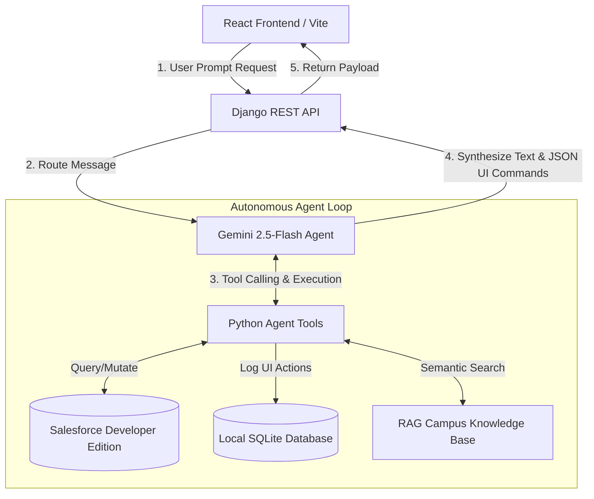

### How the Agent Loop Works:
1. **Frontend Request**: The React application sends a user prompt (e.g., "Check my holds and open a ticket for my dorm") to the Django API.
2. **Action Routing**: The Django View routes the incoming message to the central Agent.
3. **Autonomous Execution**: Gemini evaluates the request and determines which tools to call. If it needs Salesforce data, it calls the tool to execute Python code via the `simple-salesforce` API.
4. **UI Action Triggering**: As the tools execute, they intelligently generate `AtlasAction` records to log the interactions. 
5. **Dynamic Rendering**: Gemini synthesizes the tool outputs into a natural response, returning both text and structured JSON payloads that instruct the React frontend to natively render beautiful components (like Progress Rings, Tables, or Info Cards) right in the chat flow!

---

## 🛠 Tech Stack

### Frontend UI (`/atlas-compass-buddy`)
- **Framework**: React + Vite
- **Language**: TypeScript
- **Styling**: Tailwind CSS, shadcn-ui, Framer Motion
- **Features**: Real-time markdown rendering, fluid animations, dynamic data components triggered by LLM responses.

### Backend Engine (`/atlas_backend`)
- **Framework**: Django & Django REST Framework
- **Language**: Python
- **Database**: SQLite (Local development) / Syncs with Salesforce Models

### Enterprise & AI Integration
- **System of Record**: Salesforce Developer Edition
- **API Client**: `simple-salesforce`
- **Generative AI**: Google Gemini API (`google-generativeai`)

---

## 📸 Comprehensive Application Previews

*Below is a complete visual walkthrough of the Atlas Student Portal, encompassing the core navigation pillars, the tutorial experience, and the generative Agent's dynamic UI capabilities.*

### 1. The Landing & Dashboard Experience
<p align="center">
  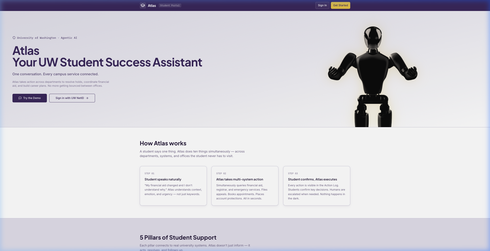
  <br>
  <i>The entry point to the Atlas ecosystem, featuring a beautiful UW-themed design.</i>
</p>

<p align="center">
  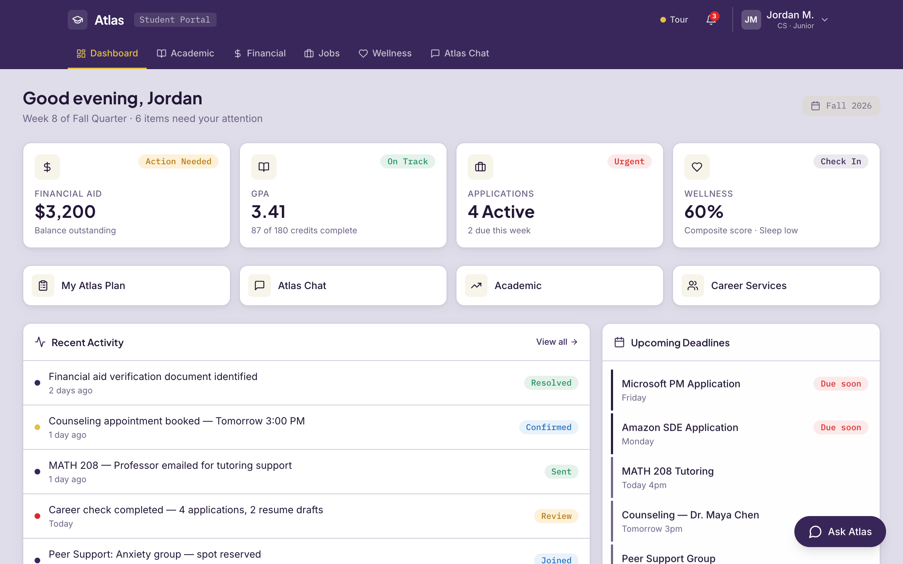
  <br>
  <i>The Dashboard: A centralized hub for the student's holistic university life.</i>
</p>

<p align="center">
  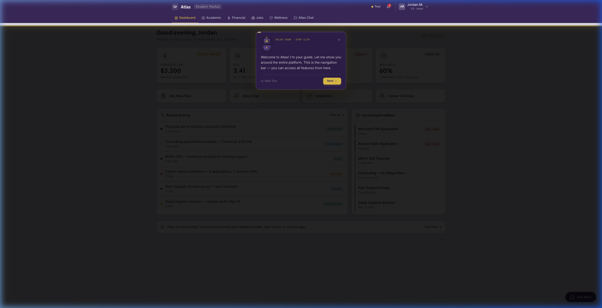
  <br>
  <i>An interactive, guided tour overlay demonstrating key platform features.</i>
</p>

### 2. The Five Pillars of Support

Atlas categorizes support into distinct, purpose-built pillars. Each page aggregates relevant data from the Salesforce backend:

| Academic | Financial |
|:---:|:---:|
| 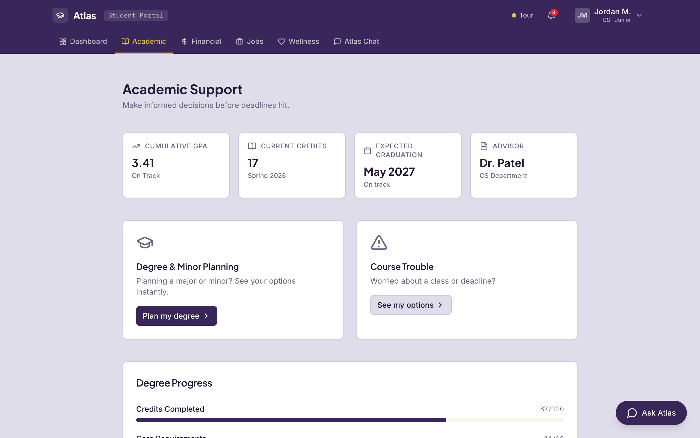 | 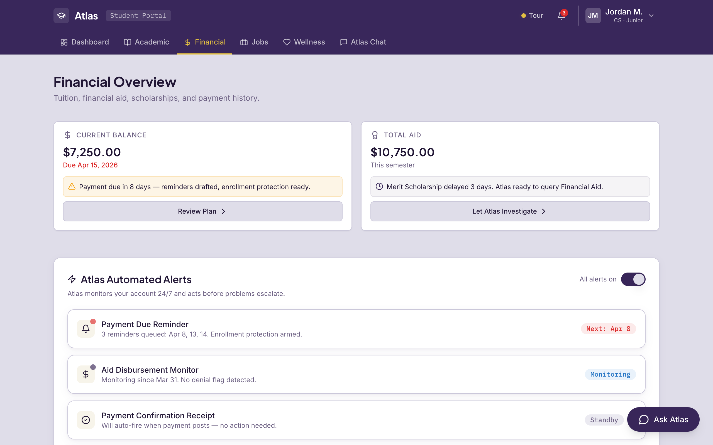 |

| Career & Jobs | Wellness |
|:---:|:---:|
| 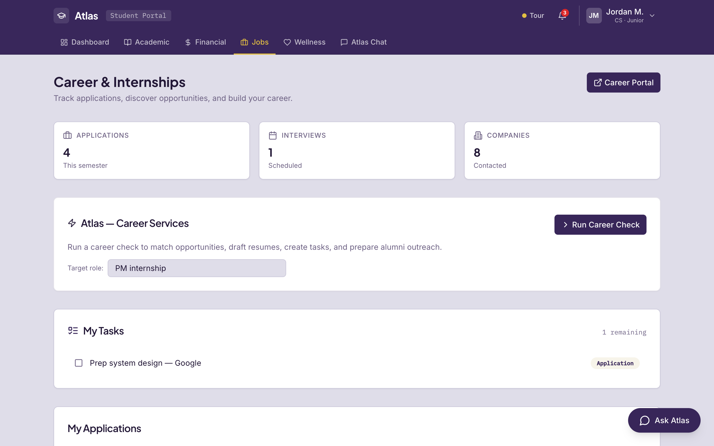 | 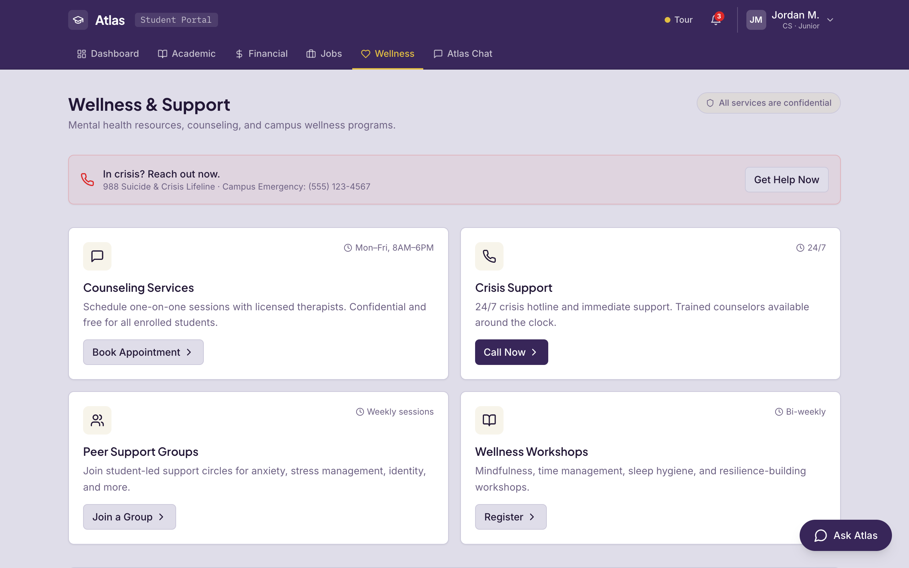 |

<p align="center">
  **My Plan & Profile Management**<br>
  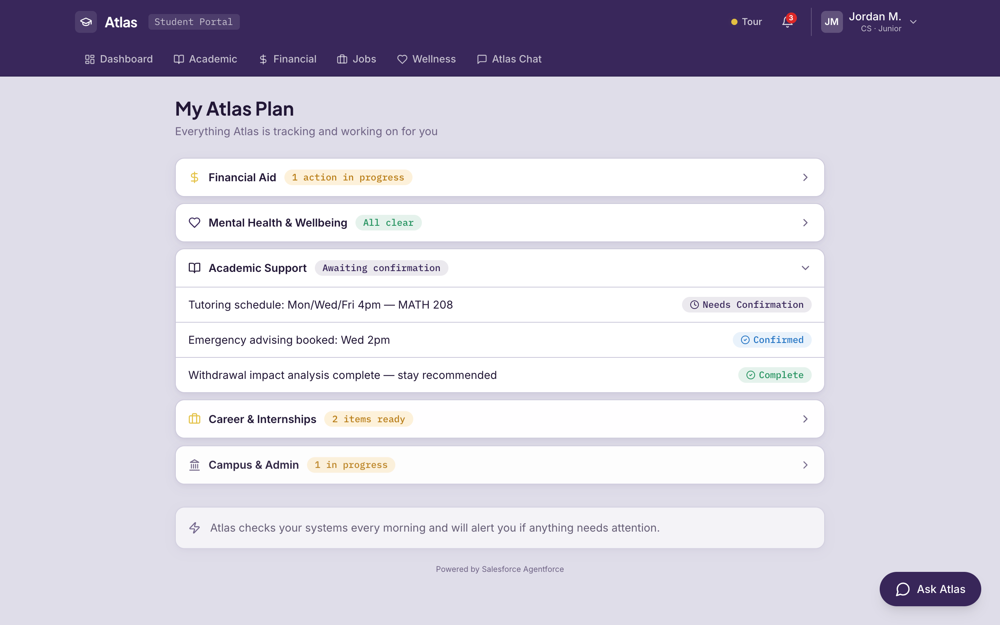 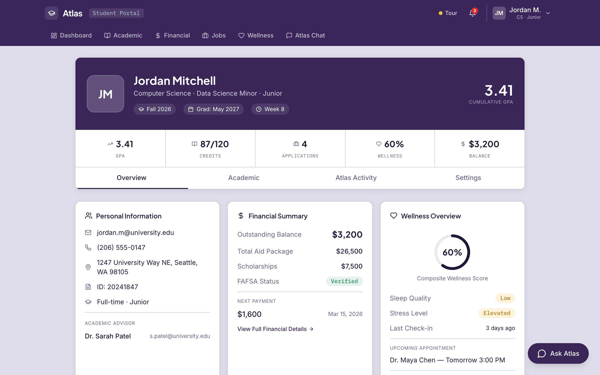
</p>

---

### 3. Agentic Chat Flows & Native UI Rendering

The true power of Atlas lies in its Agentic Engine. The Gemini LLM parses intent, calls Python tools, and instructs the React frontend to natively render UI components directly into the chat flow.

#### The Agent Interface & Action Log
The right-hand panel visualizes the "Brain" at work. As the Agent executes tools, it logs Actions (with Agentforce metadata) indicating exactly what system it touched.
<p align="center">
  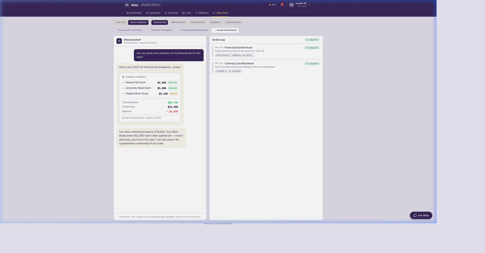
</p>

#### Visual Degree Audit
When a student asks, *"How close am I to graduating?"*, the Agent runs an audit against their transcript and renders an interactive Progress Ring component.
<p align="center">
  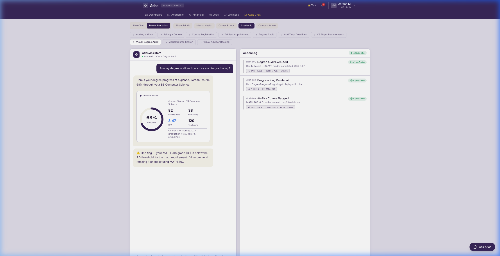
</p>

#### Actionable Course Registration
When requested, the Agent searches the MuleSoft catalog API. It returns an interactive course results table directly in the chat, allowing the student to execute course enrollment without leaving the conversation.
<p align="center">
  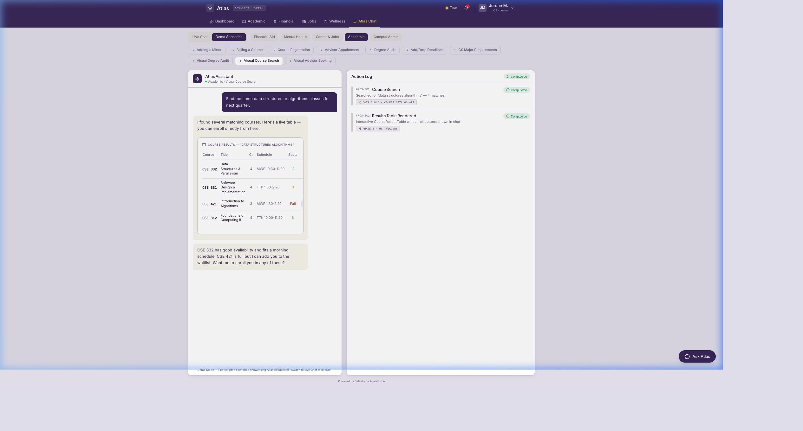
</p>

#### Financial Aid Breakdown
The Agent calculates the breakdown of grants, work-study balances, and pending documents, rendering a rich semantic Financial Card instead of an exhaustive wall of text.
<p align="center">
  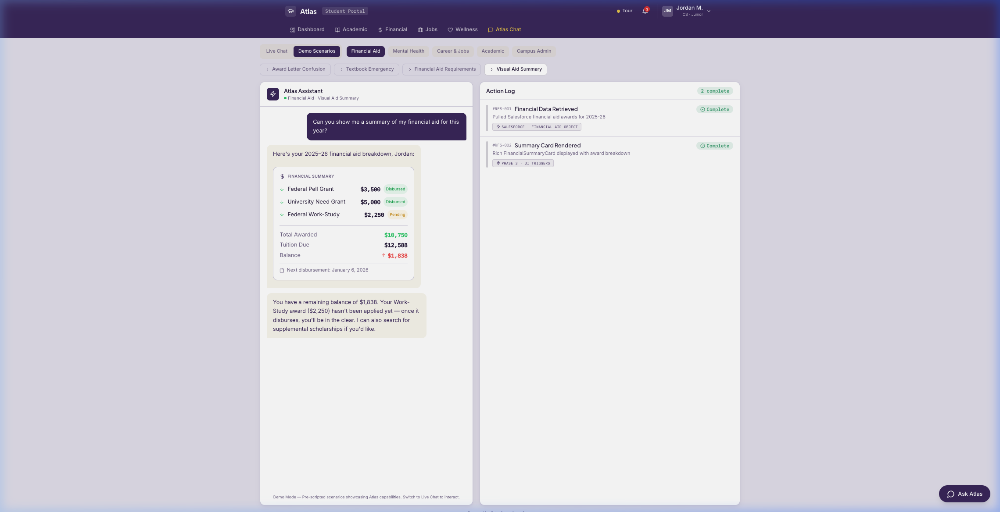
</p>

#### Crisis Detection & Case Escalation
If a student expresses distress, the Agent detects the crisis, immediately pages the on-call counselor via Salesforce Service Cloud, and flags the UI with a distinct red Emergency Support mode.
<p align="center">
  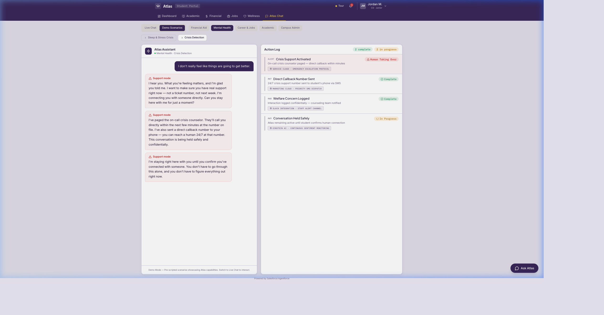
</p>

#### Automated Career Planning
When a student asks for internship help, the Agent parses their academic record, identifies skill gaps, queries the alumni network, and generates a personalized 8-week multi-step career plan.
<p align="center">
  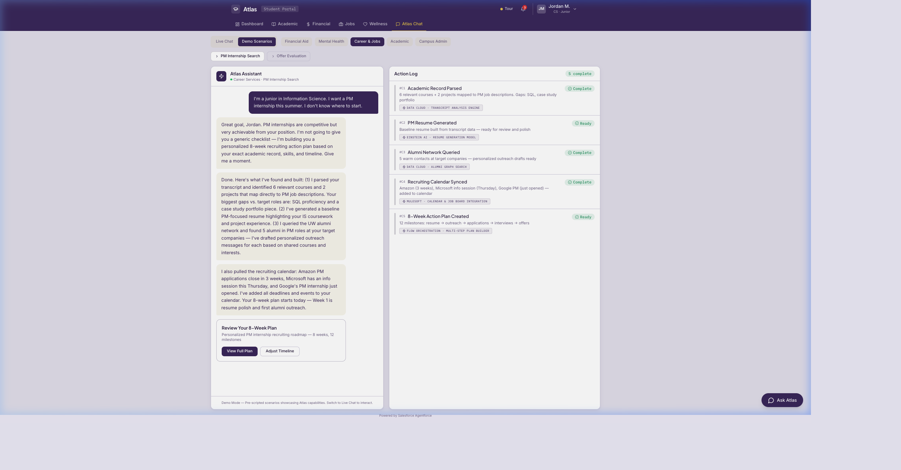
</p>

---

## 🧠 Current Agent Capabilities (Features)

The Gemini Agent currently possesses an impressive suite of tools across various university domains:

### 1. 🛡 Administrative & Support
- **Immunization & Hold Checks**: Instantly verifies if a student has account holds and generates visual "Warning" Action Cards.
- **Financial Aid Retrieval**: Pulls the latest award letters, calculating pending verifications and current balances, and displays them via structured Financial Summary Cards.
- **Support Case Escalation**: Autonomously connects to Salesforce and creates high-priority Case tickets assigned to the Student's Contact ID.

### 2. 📚 Academic Planning
- **Course Registration Engine**: The agent searches available courses (filtering by keyword, department, or code) and can physically "enroll" or "waitlist" the student, updating their records in real-time.
- **Degree Audit**: Pulls the student's complete transcript to evaluate graduation progress (Credits, GPA, Requirements), rendering a rich Progress Ring natively in the chat UI.

### 3. 🗓 Advising & Appointments
- **Advisor Booking**: Checks real-time availability for advisors by department and allows the agent to book calendar appointments directly.

### 4. 🧠 Knowledge Base (RAG Integration)
- **Campus Policy Search**: Uses Retrieval-Augmented Generation (RAG) to query a robust vector knowledge base. When a student asks about nuanced campus rules, academic integrity, or deadlines, the Agent retrieves accurate policy passages with cited sources prior to answering.

---

## 💻 Local Development Setup

### 1. Backend Setup
Navigate to the Django application:
```sh
cd atlas_backend
python -m venv venv
source venv/bin/activate
pip install -r requirements.txt
```

**Environment Variables** (`.env`):
Ensure you have the required credentials:
```env
GEMINI_API_KEY=your_google_api_key
SF_USERNAME=your_salesforce_username
SF_PASSWORD=your_salesforce_password
SF_SECURITY_TOKEN=your_salesforce_token
```

**Seed Mock Data**:
To reset local records and sync dummy data to Salesforce:
```sh
python manage.py seed_sf_data
```

**Run Server**:
```sh
python manage.py runserver
```

### 2. Frontend Setup
Navigate to the React application in a new terminal:
```sh
cd atlas-compass-buddy
npm install
npm run dev
```

The application will be running locally. Open your browser to the localhost port provided by Vite!

---

## 🔮 Roadmap / Proactive Capabilities
Our future vision involves true background proactivity. The Agent will scan the Salesforce database for upcoming deadlines (e.g., tuition bills or registration windows) and autonomously send email notifications or generate proactive UI alerts without waiting for user prompts.
